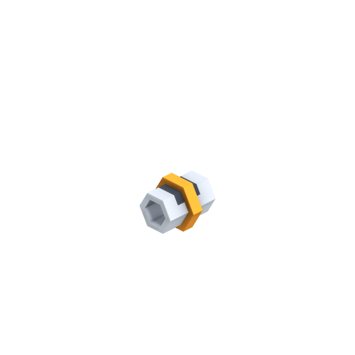
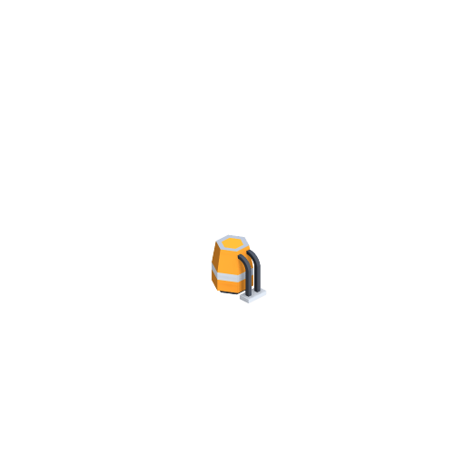

# FutureGames assignement for the Game Programming in C# course
## Lander: a game about flying, and maybe landing
### by Jo Colomban
---
### References
Given the small scope of the project, I tried to use the Unity Docs as much as possible, rather than relying too much on stackoverflow/unity forums and other sources of that kind. I of course still looked things up here and there, but nothing major. 
Even if I ended up not using a lot of it, I took inspiration and modified some code snippets from this talk about Scriptable Objects https://www.youtube.com/watch?v=raQ3iHhE_Kk. I wanted to implement an event system based on the one he demo-d in the talk, but I ended up scrapping it and now the only remains of it are in the never-merged `feature/so_events` branch.
All assets are from https://kenney.nl/, UI elements included! It's a CC0 license.
The `Init` class was lifted pretty much verbatim from one of the lectures :\)
The `Floater` class started off from https://forum.unity.com/threads/how-to-make-an-object-move-up-and-down-on-a-loop.380159/
Lastly, but most importantly, talking to my collegues and our mentor got me the most useful pieces of advice! Specifically, me and Albin Samuelsson brainstomred a missile spawining and physics approach that we ended up using in both of our games :\)

---

### Manual
Your ship has been critically damaged, the online online systems are your **emergency thrusters** and your **threat camera feed**. Land on a landing pad to proceed to the next section. Your **shields are offline**, your ship is not gonna be able to survive even the slightest impact with the rocky formations of the planet, and it can only take a few missles before full meltdown. Your **threat camera feed** is going to display what the nearest threat is seeing at the moment, use it to your advantage.
There are two different kinds of **pickups** you can find, they'll help you get to the landing zone in one piece.
- **Hull repair pickup**  Repairs the hull 

- **Drag reduction pickup**  Brings the drag-reduction system back online, reducing the ship's percieved drag. 

#### Editor-specific notes
You can start the game from any scene, thanks to the `Init.cs` script :\)


#### Controls
- **Directional thrusters**: WASD
- **Takeoff thrusters**: spacebar
- **Yaw thrusters**: Q to yaw left, E to yaw right

---

### The good - code rundown
I tried to keep the folder structure tidy by organizing the scripts in namespaces. I'm quickly going to go through each one, without getting too much in detail, the code should be pretty self-explanatory and I added some comments whereever necessary

- **Player**: Contains the Input-System-generated class (`PlayerControls`) and  the class tha handles player input (`PlayerInputHandler`). I kept input handling and ship physics completely separated, a reference to ship physics is injected in the input handler, that will call the correct fucntions to move the ship on input. This allows for implementation of more players, or even for AI-driven ships without having to touch the movement side of thing and only having to implement the input handling/generation.
- **Ship**: Handles the bulk of the player-centric game loop. 
    * `ShipPhysics`, as described above, handles all movement for the ship, exposing functions that can be used by input handlers/input generators
    * `ShipComputer`handles the ships state. It has a reference to an instance of `ShipHull`, methods to deal with losing and gaining HP, handling death and successful landings.
    * `ShipHull`is a ScriptableObject that represents the state of the ships' hull, acting as the game's health system. Having the HP stored on a SO allows me to reference it from different scripts without getting the dependecies too tangled.
    * `ThreatCameraController` is described in the bonus section at the end of this document :\)
- **Enviroment**: contains everything related to enviromental behavior, as the name suggests \:D
    * `DamageDealer` deals damage to anything that it collides with that has a `ShipComputer`attached. Destroyes itself if configured to do so. I tried to keep the class as generic as possible to make it modular and usuable for all damage-dealing entities, like static enviromental hazards and dynamic stuff like missles.
    * `Floater`makes whatever it's attached to to float on the Y axis with a certain amplitude and speed around its original position.
    * `LandingZone` triggers a landing event if something with a `ShipComputer` attached collides with it
    * `ReduceDragPickup` and `RepairPickup` apply the correct effect if something with a `ShipComputer` collides with them
- **AI**:
    * `TurretAI` makes a turret acquire the closest target (note: it's coded in a way that will work with multiple ships without any code changes required), wait a variable amount of time tracking it, shoot, reload, and then acquire the closest target again.
- **UI**: Pretty standard UI scripts, they should all be self-explantory
- **Utils**: Collection of static classes that are used around the game. 

---

### The bad - possible improvements
There a bunch of things that I would have liked to improve and/or implement having the time, I'm going to list a few in no particular order

* `TurretAI` does too many things. It should have been divided in a class that generates the input, and one that handles the physics/movement/shooting, allowing for easy implementation of stuff like player-controlled turrets for asymmetrical multiplayer, kind of like what I did for the ship's controls.
* The game is not very fun! While this isn't super relevant for the assignment, I spent too much time building system and too little time making them interact with each other to find what's fun, I should have handled my time better in that sense
* The game is lacking VFX and SFX! It's another minor thing, but it would help a lot! I started working on some fun shader stuff but I haven't been able to finish it, I'll try to do it after the deadline
* Utils, with all its static, might have been designed a bit better
* While I think I did a pretty good job at keeping most things modular, most of the classes I wrote are MonoBehaviors, I would have liked to have fewer of those and more logic in non-MB classes.

---

### The (maybe) ugly - ThreatCameraController
I had a lot of fun playing around with RenderTextures. The player camera outputs to a rendertexture that is displaying in a rawimage in a Canvas.
A similar thing is done for all the turrets. The Turret prefab has a camera attached to it, disabled by default. The `ThreatCameraController` script, attached to the player, will detect the closest turret and enable its camera, that is going to start outputting to a RenderTexture displayed in the bottom right of the Canvas. The part I found the hardest and most fun is making this camera feed's size change inversly proportional to the ship's distance from the turret, which is done through this little very ugly snippet of math
```C#
private void ResizeThreatRenderTexture() {
    float normalizedDistance = Math.Clamp(distanceFromCurrentTarget / maxDistance, 0, 1);
    Vector2 newAnchoredPosition = initialAnchoredPosition * normalizedDistance;
    Vector2 newSizeDelta = initialSizeDelta * normalizedDistance;
    turretRenderTextureImage.rectTransform.anchoredPosition = new Vector2(Mathf.Lerp(turretRenderTextureImage.rectTransform.anchoredPosition.x, newAnchoredPosition.x, dangerCameraGrowingSpeed), Mathf.Lerp(turretRenderTextureImage.rectTransform.anchoredPosition.y, newAnchoredPosition.y, dangerCameraGrowingSpeed));
    turretRenderTextureImage.rectTransform.sizeDelta = new Vector2(Mathf.Lerp(turretRenderTextureImage.rectTransform.sizeDelta.x, newSizeDelta.x, dangerCameraGrowingSpeed), Mathf.Lerp(turretRenderTextureImage.rectTransform.sizeDelta.y, newSizeDelta.y, dangerCameraGrowingSpeed));
}
```
It's not super useful for the gameplay experience, but I found it super interesting and I think it's a good skill to have, it can be used, for instance, for more advanced-split screen setups, Portal-style shenanigans, and so on.
